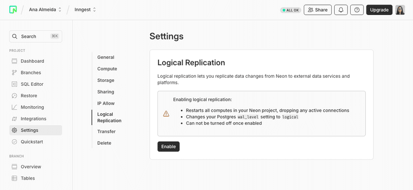
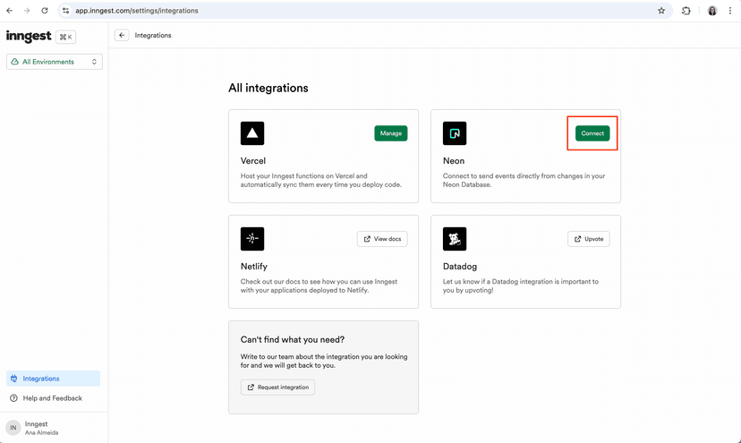
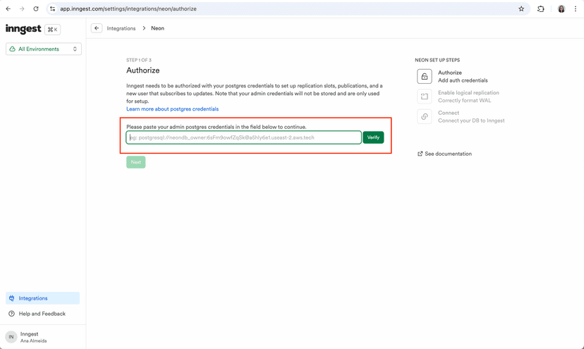
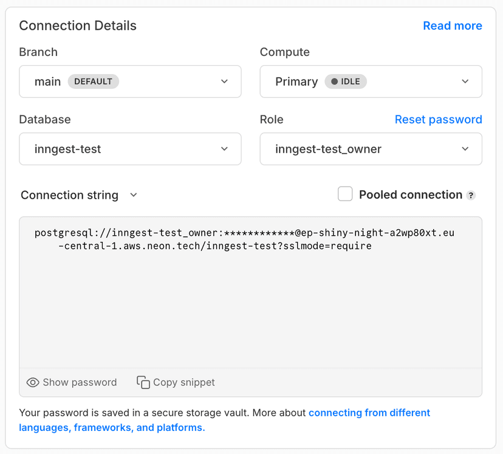

# Build a semantic search with Next.js, Neon and Inngest

_TODO: video thumbnail_

## What we'll build

Add a semantic search in our Next.js CRM application using Neon and Inngest.
Inngest will generate and store embeddings every time a contact is created.

## Tech Stack

- [Next.js](https://nextjs.org/) - React framework
- [Neon](https://neon.tech/docs/guides/nextjs) - Serverless Postgres database
- [Inngest](https://www.inngest.com/docs/quick-start) - Serverless Workflow engine
- [Drizzle](https://orm.drizzle.team/) - Database ORM
- [OpenAI](https://platform.openai.com/) - Embedding API

## Deploying the app

Before you begin, ensure you have:

- Node.js and npm installed
- A [Neon](https://neon.tech) account
- An [OpenAI](https://platform.openai.com/) account
- A [Inngest](https://www.inngest.com/) account

## Getting Started

## 1. Create a Neon project

If you do not have one already, create a Neon project:

1. Navigate to the [Projects](https://console.neon.tech/app/projects) page in the Neon Console.
2. Click **New Project**.
3. Specify your project settings and click **Create Project**.

## 2. Initialize the project

To create the database and tables, first, clone the repository:

```bash
git clone git@github.com:inngest/nextjs-inngest-neon-auto-embeddings.git
```

Then, install the dependencies:

```bash
cd nextjs-inngest-neon-auto-embeddings
npm install
```

Create a `.env.local` file with the following variables:

```bash
DATABASE_URL=<your-neon-database-url>
```

Finally, run the drizzle migrations:

```bash
npx drizzle-kit generate
npx drizzle-kit migrate
```

You Neon database is now ready to work with your application.

## 3. Enabling Logical Replication on your database

The Inngest Integration relies on Neon’s Logical Replication feature to get notified upon database changes.

Navigate to your Neon Project using the Neon Console and open the **Settings** > **Logical Replication** page. From here, follow the instructions to enable Logical Replication:



## 4. Configuring the Inngest integration

Your Neon database is now ready to work with Inngest.

To configure the Inngest Neon Integration, navigate to the Inngest Platform, open the [Integrations page](https://app.inngest.com/settings/integrations?utm_source=neon&utm_medium=trigger-serverless-functions-guide), and follow the instructions of the [Neon Integration installation wizard](https://app.inngest.com/settings/integrations/neon/connect?utm_source=neon&utm_medium=trigger-serverless-functions-guide):



The Inngest Integration requires Postgres admin credentials to complete its setup. _These credentials are not stored and are only used during the installation process_.



You can find your admin Postgres credentials in your Neon project dashboard’s **Connection Details** section:



### 5. Deploy on Vercel

Using the following button to create a new Vercel project using this repository:
[](https://vercel.com/new/clone?repository-url=https%3A%2F%2Fgithub.com%2Finngest%2Fnextjs-inngest-neon-auto-embeddings)

Once your Vercel project is deployed, navigate to the [Inngest Vercel Integration page](https://vercel.com/integrations/inngest) and click **Connect Account**.

Once your Vercel project is connected, navigate to your Environment Variables page and add the following variables:

- `OPENAI_API_KEY` - Your OpenAI API key
- `DATABASE_URL` - Your Neon database URL

You application is now deployed on Vercel, properly linked to Neon and Inngest!

---

_Licensed under the [Apache License](./LICENSE)._
